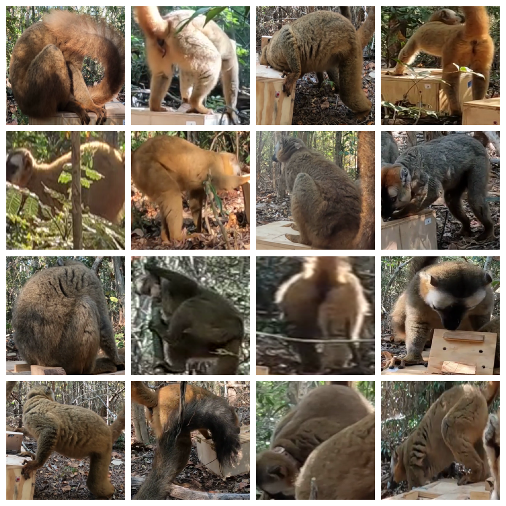
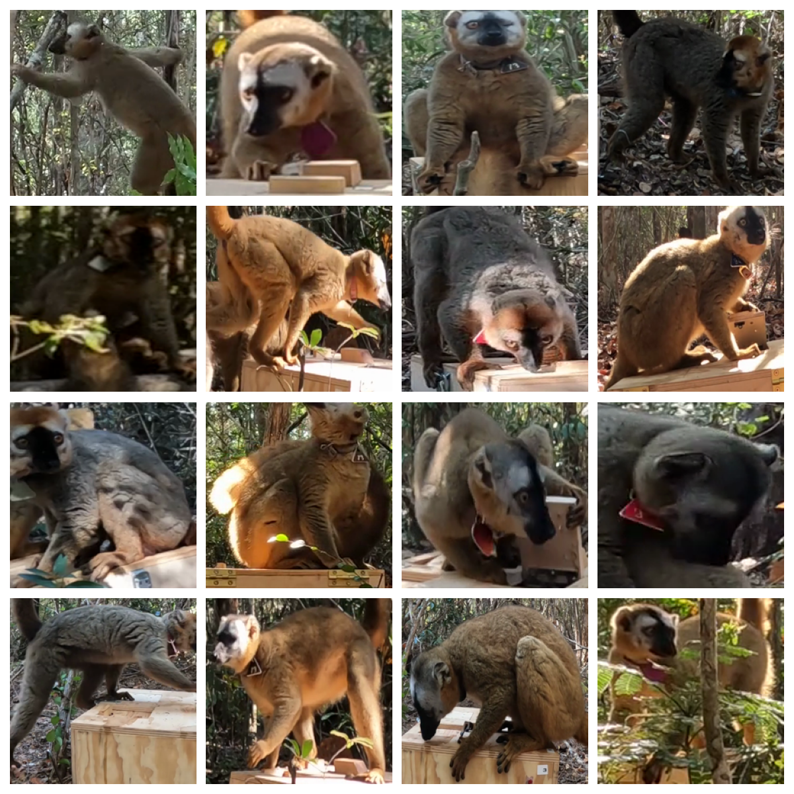

## Model in the loop as an effort-efficient learning technique

We want to identify individual lemurs using a simple ResNet18. The problem is that the lemurs change over time, new lemurs join groups and others leave. As there are 4-5 groups in total, and data from 4 field seasons, this will require many different models.
One option is to select individual images for each lemur manually, but this is very time consuming.

### Sorting model

One issue with tracking lemurs in the wild is that the animals are often with the back to the camera, partly occluded or far away and thus not easily identifiable. However, we only need them to be identifiable on a few frames, as we can propagate the label through the whole track, as described in [PriMAT](https://github.com/ecker-lab/PriMAT-tracking).
If we want to train a model for identification, it is helpful to select frames in which the individual is identifiable, otherwise the model can be distracted by too much noise (in the sense of images that could be any individual).

The sorting model helps to select frames that we consider useful. It is a simple ResNet18 that has been trained on a binary classification task of usefulness for identification. 
Samples that are not useful:

Samples that are useful:

To make the selection of images with which to train the sorting model, use label_tool_from_scratch.py. To train the sorting model, use train_sorting_model.py. To visualize samples from each class, use dataset_review.py.

### Identification model

